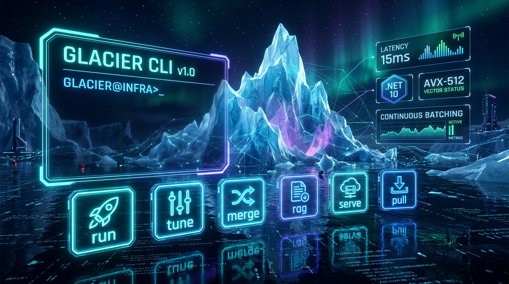

# GLACIER CLI: The Unified Pure C# .NET 10 LLM Tool



<div align="center">

### 🚀 **< 15ms** Cold Start &nbsp;|&nbsp; ⚡ **Zero** Python / C++ &nbsp;|&nbsp; 💎 **100% Pure C# .NET 10**

**One single global CLI tool replacing Ollama, vLLM, HuggingFace CLI, Unsloth, and RAGFlow.**

[](https://www.nuget.org/packages/Glacier.Cli)
[](LICENSE)
[](https://dotnet.microsoft.com/)
[](https://learn.microsoft.com/en-us/dotnet/core/deploying/native-aot/)

</div>

---

## ⚡ Install in One Command

### 🪟 Windows (PowerShell One-Liner):
```powershell
irm https://raw.githubusercontent.com/ian-cowley/Glacier.Cli/main/install.ps1 | iex
```
*Or download [`glacier-win-x64.zip`](https://github.com/ian-cowley/Glacier.Cli/releases/latest/download/glacier-win-x64.zip) and double-click `install.bat`.*

### 🐧 Linux & 🍎 macOS:
```bash
curl -fsSL https://raw.githubusercontent.com/ian-cowley/Glacier.Cli/main/install.sh | bash
```

### 📦 Via .NET 10 Global Tool:
```bash
dotnet tool install -g Glacier.Cli
```

---

## 🎯 The Universal Command Matrix

| Command | Purpose | Benchmark / Highlight |
| :--- | :--- | :--- |
| **`glacier run`** | Instant GPU/CPU streaming inference & REPL | **<15ms cold start**, AVX-512 & Bare-Metal SASS |
| **`glacier tune`** | In-process PEFT LoRA fine-tuning | **20 min full training** vs 4h 25m in Python |
| **`glacier merge`** | Zero-copy GGUF adapter fusion | **< 60s** lossless Q8_0 fusion |
| **`glacier rag`** | SIMD Vector + CSR Knowledge Graph RAG | **< 10ms hybrid retrieval**, zero-copy graph traversal |
| **`glacier serve`** | Ollama & OpenAI HTTP continuous batching | **PagedAttention**, 16,000+ req/s throughput |
| **`glacier pull`** | High-speed chunked GGUF downloader | Multi-threaded download with live ETA & speed gauge |

---

## ⚡ 60-Second Quickstart

### 1. Instant Inference (Llama 3, Phi-4, DeepSeek, Qwen)
```bash
# Streaming answer to a single prompt
glacier run model.gguf "Explain quantum computing in two sentences"

# Interactive terminal chat REPL
glacier run model.gguf
```

### 2. In-Process Fine-Tuning & Adapter Export
```bash
# Fine-tune in 20 minutes directly in pure .NET 10
glacier tune base.gguf --data dataset.jsonl --epochs 3 --rank 16 --out adapter.bin

# Fuse LoRA adapter directly into a standalone production GGUF
glacier merge base.gguf adapter.bin model-enterprise.gguf
```

### 3. In-Process GraphRAG
```bash
# Index documents and stream grounded responses with structural graph hops
glacier rag --model model.gguf --docs ./knowledge --query "What is our architecture?"
```

### 4. Continuous Batching Server (Drop-in Ollama & OpenAI)
```bash
# Serves POST /v1/chat/completions (OpenAI) and POST /api/chat (Ollama)
glacier serve model.gguf --port 11434 --blocks 1024 --batch-size 16
```

### 5. Download Foundation Models
```bash
# Pull directly from HuggingFace with live progress tracking
glacier pull lmstudio-community/Meta-Llama-3.1-8B-Instruct-GGUF
```

---

## 🖥️ Hardware & Model Compatibility

- **Hardware Acceleration**: NVIDIA RTX 40/30 series (Pure C# SASS / HIP / Vulkan), AMD Radeon 890M / RDNA3 (DirectML / HIP), Host CPUs (SIMD AVX-512 & AVX2).
- **Supported Architectures**: Meta Llama 3/3.1/3.2/3.3, Microsoft Phi-4/Phi-3, DeepSeek-V2/V3/R1, Mistral/Devstral, Alibaba Qwen 2/2.5.
- **Quantization Types**: `Q4_K_M`, `Q5_K_M`, `Q6_K`, `Q8_0`, `Q4_0`, `MXFP4`, `F16`, `F32`.

---

## 📄 License
MIT License. High-Performance Pure C# .NET 10 Ecosystem.
